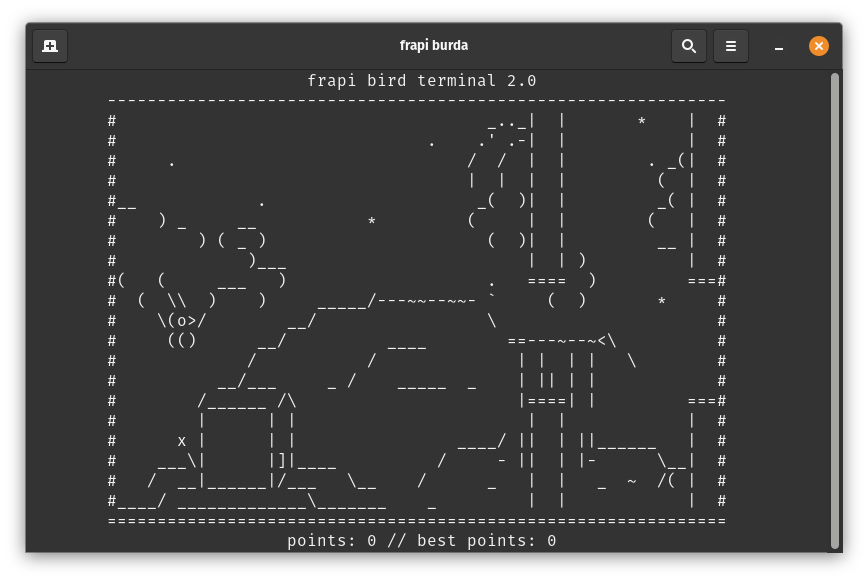

# frapi-burda
copia de flapy bird no terminal :3
</img>

<div>
  
  para compilar no linux e nessesario instalar o gcc e a bliblioteca ncurses, para isso execulte
  ```
  sudo apt install gcc
  sudo apt install libncurses-dev
  
  ou
  
  sudo pacman -Sy gcc
  sudo pacman -Sy libncurses-dev
  ```
  e compile com
  ```
  mkdir build 
  chmod +x run.sh
  ./run.sh 
  ```
  
  
  e para compilar no windows sera nessesario ter o compilador mingw instalado
  ```
  mkdir build 
  .\run.bat 
  ```
  
  o execultavel estara na pasta build
  
</div>
